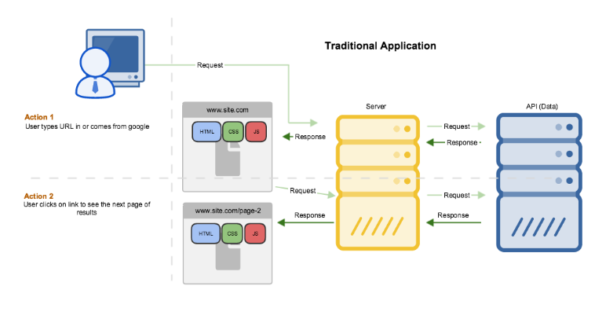

# Problem 
Instead of importing json data setup the express server with an end point to return the data
so we can make an API call to fetch the data instead. The component should display the text `loading...`
while it is fetching the data and once the response has returned display the properties.
<div>


</div>

# Tips
- Expose an endpoint in express so that `localhost:3001/api` returns the json data
```js
app.get('/api', mockAPI);
```
where mockAPI is a function that might look something like this:
```js
import mockData from './mockData.json'

export default (_, response) => {
    response.setHeader('Content-Type', 'application/json');
    response.send(mockData);
};
```
- React offers [lifecycle](https://facebook.github.io/react/docs/react-component.html) methods for
you to run logic. `componentDidMount` is one such method that executes on the client immediately
after the first render of the component. this is a good spot to make an API call.
- Use the Fetch API to make a request as it is supported by Chrome 
```js
    fetch('http://host/api')
        .then(response => response.json())
        .then(data => {
            // Do something with data
        });
```
We've seen how we can pass in variables to a react component using props. React also offers the ability 
to set [state](https://facebook.github.io/react/docs/react-component.html#setstate) within a component.
Once the API has returned we can use this API to set the state of the component.
[Here's what this might look like](https://github.com/azaharakis/ui-training/tree/master/src/3.%20React/2.%20Managing%20State)  

### Bonus
- [fetch API](https://developer.mozilla.org/en/docs/Web/API/Fetch_API#Browser_compatibility) is only supported in a
few browsers, setup a [polyfill](https://remysharp.com/2010/10/08/what-is-a-polyfill/) to support the other browsers
[isomorphic fetch](https://github.com/matthew-andrews/isomorphic-fetch) is a good option as we'll explain in the next
chapter

## Solution
- [Solution](https://github.com/azaharakis/app-with-server-rendering/compare/8d5fa2c...09c9e80)
