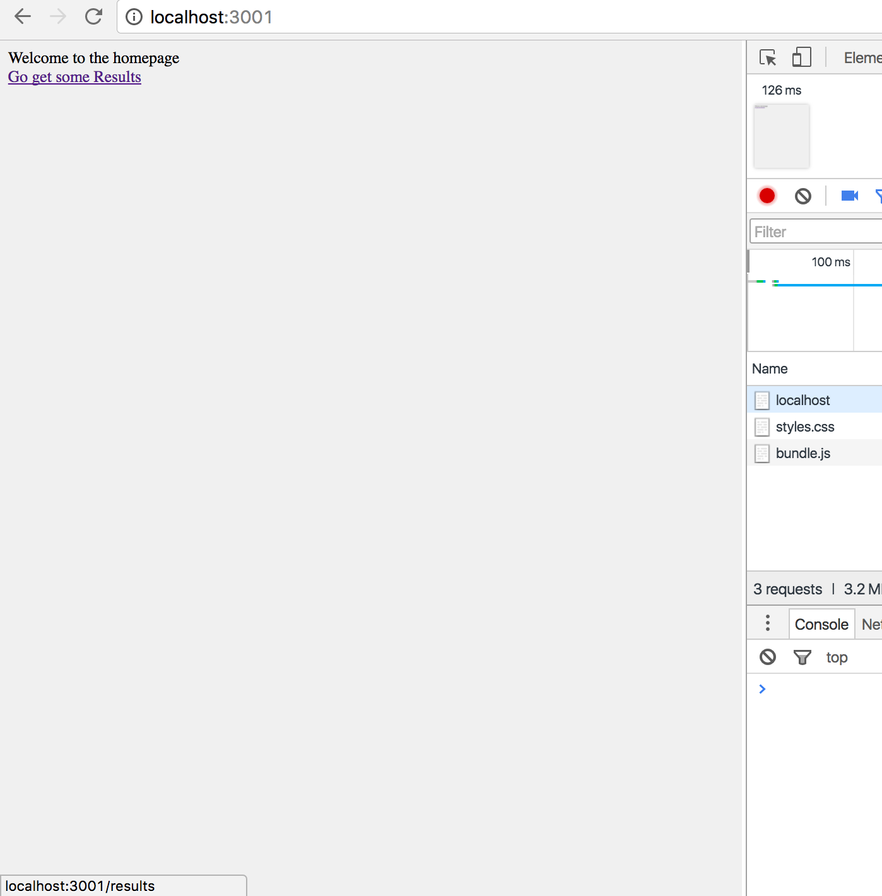
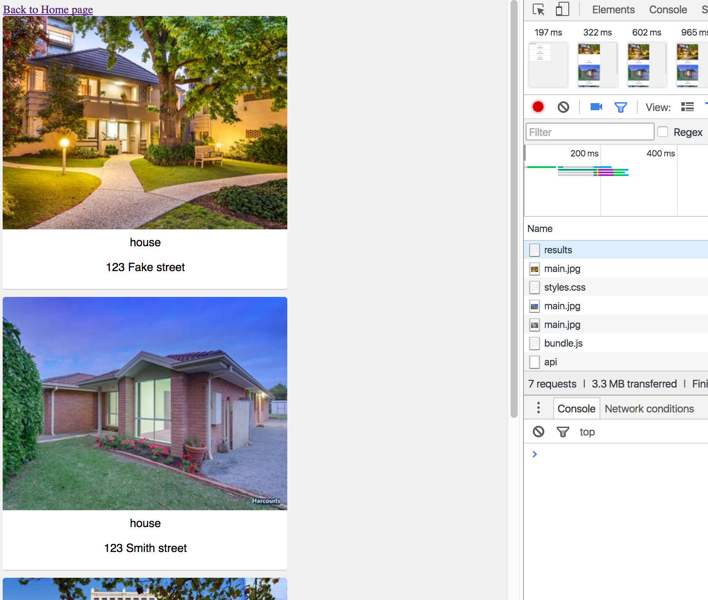
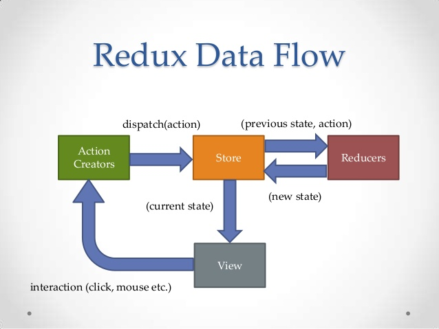
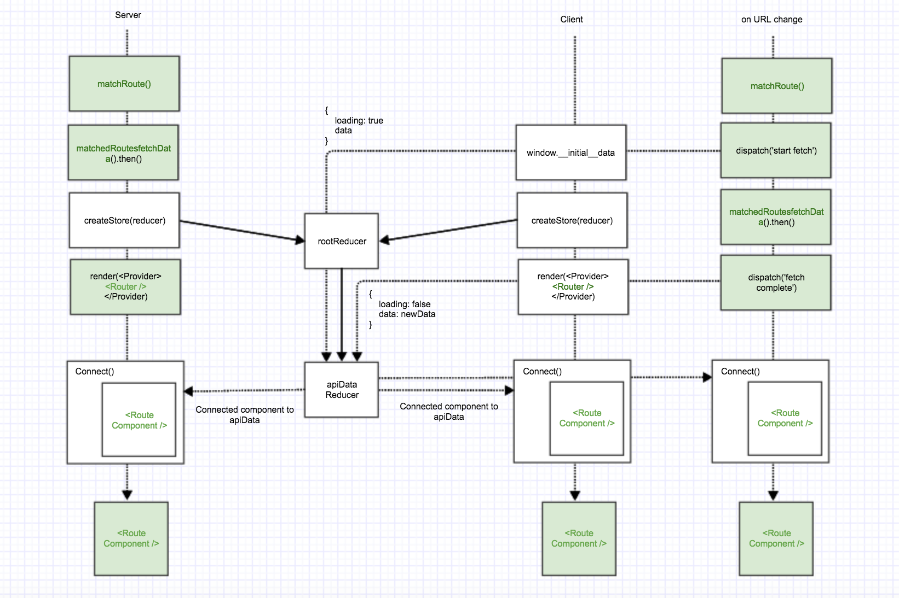

### Problem 
Currently our application only has one screen. It would be great to add additional screens
to the application, such as a homepage, where in the future we could set it up so that users
 could perform a search. We can modify our application to take advantage of rendering our
 initial application on the server but then any subsequent navigation will be handled by 
 react. Meaning it changes will be done by the browser using javascript rather then requesting
 the server send back the next (page | screen) html.
 
From a high level we can visualize interaction's like this for a traditional web application: 
<div></div>
And like this for a universal | isomorphic application
<div></div> 
Where with pages that have no API data requirements we can just render instiantaniously via javascript.
Under certain scenario's that has allowed us to go from page load speeds that took [18 seconds to 2 seconds](https://community.rea-group.com/blogs/tom/2016/10/10/unpacking-the-new-sold-experience-performance)
with our replatformed [application](https://www.realestate.com.au/sold/list-1)

- Add a homepage which has a link to our results page of properties
- Add a link back to the homepage from the results page
- Which ever page we load first should be rendered by the server
- Any subsequent page we navigate to should be rendered by the client.

### Homepage
<div></div> 
This screen or Route has no data requirements

### Results Page
<div></div>
 This screen or Route has data requirements


# Before we start

## React Router
- A Routing solution such as [react-router](https://github.com/ReactTraining/react-router) will make this a lot easier `yarn add react-router`
 to transition between different screens. Before we start trying to integrate it into our current solution
 we should take at how it works in a simple scenario.
 
 ```js
    // client/index.js
    import { Router, Route, browserHistory } from 'react-router'
    render(
      <Router history={browserHistory}>
        <Route path="/" component={App}>
          <Route path="about" component={About}/>
          <Route path="something-else/:id" component={SomeOtherScreen}/>
        </Route>
      </Router>
    );
    //App Component
    ...
    render(
        <div>
            <Header />
            { this.props.children }
            <Footer />
        </div>
    );
    //About Component
    ...
    render(
        <div>
            About our company...
        </div>
    );
```
- Router is the top level component that allows us to render different Components when the URL changes 
    - browserHistory is the underlying mechanism which we pass to the instance of react router created to listen to url changes.
It uses the [history API](https://developer.mozilla.org/en-US/docs/Web/API/History_API) to do this. There are other ways this can be done,
but this is the way that is relevant to us.
- Route has the following props
    - `path` is the URL that we match against to render a 
    - `component` the react component we assign to the Route.


## dispatch events with Redux     
To push changes to your store redux uses the concept of dispatching. Through this
paradigm achieves a one way data flow, and we can see this represented by the following diagram:
<div></div>
In complex applications one way data flow can simplfy the mental model we have for application state.
In our use case we will be dispatching actions that update the API data within it's reducer when the user navigates 
the application.

## What we are trying to acheive
<div></div>
 
## Tips 
- We want to change the express method that assigns the `middleware` to use `use` rather then `get` 
as we now want to routing to react router. This will mean any path
that's not matched in one of the previous express configs will be run through `./src/server/middleware.js`
- Using a static method [fetchData](https://github.com/azaharakis/app-with-server-rendering/blob/lesson_10/src/screens/app/Container.js#L15) we are able to co-locate the API call
to the component that requires that data, although the as we have seen the API call is made higher up. 
 Now that we have multiple route's and screens which are matched dynamically we need a way to find the 'active routes' 
 fetchData method.
```js
const emptyPromise = () => Promise.resolve();

const fetchData = ({ routes }) => {
    const matchedRoute = routes[routes.length - 1];
    const fetchData = matchedRoute.fetchData || emptyPromise;

    return fetchData();
}

fetchData(routingState)
``` 
 
## Solution
- [Solution](https://github.com/azaharakis/app-with-server-rendering/compare/9b8e557...c1946d1)
